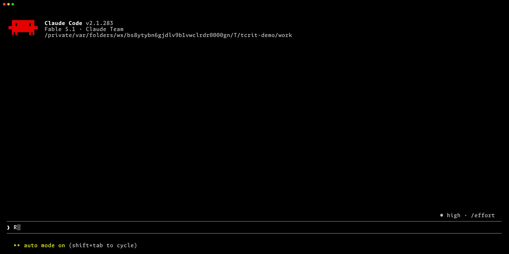
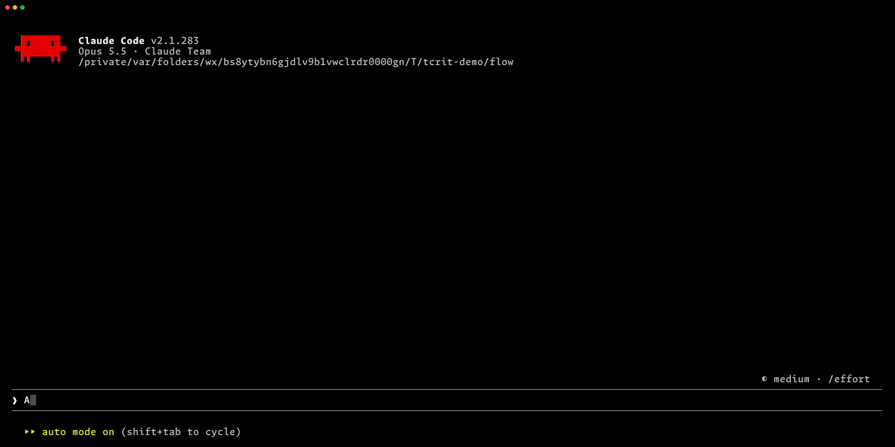

<p align="center">
  
</p>

# tcrit

> **tcrit** is a fork of [kevindutra/crit](https://github.com/kevindutra/crit). It installs the command as `tcrit` and includes fixes and improvements not yet merged upstream; see [docs/upstream-differences.md](docs/upstream-differences.md) for the full list.

TUI for reviewing AI-generated code and plans — built for human-in-the-loop agentic coding workflows.

Read a plan or review code changes across multiple files, leave inline comments, and let your coding agent address the feedback automatically.

Your agent writes code or a plan, you review it in the TUI, and the agent reads your comments and makes changes for the next round.



## Key Features

- **Review in the terminal** — read plans, documents, and multi-file diffs with syntax highlighting, and comment on a line, a range, a deleted line, or a whole file.
- **Round trips with your agent** — the agent opens the review in a Herdr tab or a tmux split, waits for you to submit, reads your comments, and comes back with the next round.  `tcrit install` sets this up for Claude Code, Codex, OpenCode, and Gemini CLI.
- **Any change set** — staged, unstaged, or committed ranges such as `main...`, supplied diffs from `git diff | tcrit --diff`, single documents, and versioned plans that carry comment threads across revisions.
- **Comments made for code review** — replies, resolve and reopen, GitHub-style suggestions, clipboard images, `@path L40` and comment-ID references, and editing in `$EDITOR`.  Multi-line comments follow insertions and deletions within the selected range across review rounds.
- **Fast navigation** — a file tree sidebar, fuzzy file switching, `n` / `N` across changes and open threads, whitespace-insensitive diffs, and `H` to hide comments while reading.
- **Mouse and keyboard** — vim-style keys throughout, plus clickable tabs, lines, threads, and buttons, gutter drag to select ranges, and wheel scrolling.
- **Scriptable and Crit-compatible** — [Crit](https://crit.md/)-compatible `review.json`, `tcrit comment` and `tcrit comments` for automation, and sessions that stop and resume by ID.
- **Readable on any terminal** — light and dark backgrounds, per-author colors, compact tab paths, and a review bar that names what is under review.

## Install

Install the `tcrit` binary, then install the review skills for your agent with `tcrit install`.

### Command-line binary

With [mise](https://mise.jdx.dev/):

```bash
mise install github:knu/tcrit
```

With Go:

```bash
go install github.com/knu/tcrit/cmd/tcrit@latest
```

Make sure `$GOPATH/bin` (defaults to `~/go/bin`) is in your `PATH`:

```bash
export PATH="$PATH:$(go env GOPATH)/bin"
```

### Codex with a background server

> [!WARNING]
> [Codex 0.157.0](https://github.com/openai/codex/releases/tag/rust-v0.157.0) enabled automatic background-server startup by default.  Its shell tools no longer share the invoking terminal's process ancestry, so TCrit cannot recover the tmux or Herdr context from that ancestry.  Start Codex through `tcrit codex` or the bundled wrapper when using tmux or Herdr.

From your tmux pane or Herdr terminal:

```bash
tcrit codex
tcrit codex resume
```

Launch Codex through `tcrit codex`, or put TCrit's bundled `codex` wrapper before the original Codex in PATH.  The wrapper records which tmux or Herdr pane Codex runs in, then starts Codex with its arguments and environment unchanged.  `go install github.com/knu/tcrit/cmd/...@latest` installs both binaries; the [mise GitHub backend](https://mise.jdx.dev/dev-tools/backends/github.html#bin_path) exposes both from the release archive when `github:knu/tcrit` comes before the tool providing Codex in `[tools]`.

Before each review round the TCrit skill displays a one-time marker, and TCrit looks for it in the registered panes to find where to open the review, so keep the marker visible.  A terminal filter such as [tfil](https://github.com/knu/tfil) 0.4.0 with `--tcrit-notify` can report the marker directly instead; the protocol is described in [docs/terminal-filter.md](docs/terminal-filter.md).

### Agent skills

The binary embeds the integration for each agent and installs it with `tcrit install`, so the skills always match the installed version. Every target provides two pieces:

- `tcrit [file]` — the interactive review loop. It opens the TUI on the git changes (`tcrit`), a document (`tcrit <file>`), or a versioned plan (`tcrit plan <file>`), then has the agent address the comments round by round.
- `tcrit-cli` — a reference skill the agent loads when it needs `tcrit comment`, `tcrit comments`, session or plan targeting, bulk JSON input, or the review file format.

When you submit a round, the agent receives every thread, including resolved ones, so your final instructions reach it even on approval.  It replies only where there is new feedback, and it waits for your submission for 10 minutes by default; if that wait times out, send `hey` after submitting.  `tcrit stop --session <id>` keeps a review for later and `tcrit clear` deletes it.

Run the installer from your home directory to install globally, or from a repository root to install for that project only.

#### Claude Code

```bash
cd ~ && tcrit install claude-code   # ~/.claude/skills/{tcrit,tcrit-cli}/
tcrit install claude-code           # From a repo root: install for that project
```

Then use `/tcrit [file]`.

#### Codex

```bash
cd ~ && tcrit install codex        # ~/.agents/skills/{tcrit,tcrit-cli}/
tcrit install codex                # From a repo root: install for that project
```

Then use `$tcrit`. The installed skills use Codex invocation syntax and reply attribution.

#### OpenCode

```bash
cd ~ && tcrit install opencode     # ~/.config/opencode/commands/tcrit.md and ~/.config/opencode/skills/tcrit-cli/
tcrit install opencode             # From a repo root: install for that project
```

Then use `/tcrit [file]`.

#### Gemini CLI

```bash
cd ~ && tcrit install gemini        # ~/.gemini/skills/tcrit/ and ~/.gemini/skills/tcrit-cli/
tcrit install gemini                # From a repo root: install for that project
```

Ask Gemini to use the `tcrit` skill to review your changes or a document. The current agent runs the review loop using the same instructions as the other integrations. Use `/skills reload` if Gemini CLI is already running, and `/skills list` to check discovery.

If you used the earlier `@tcrit` subagent integration, remove the old `.gemini/agents/tcrit.md` yourself; the installer leaves it in place.

#### Prompt templates

```bash
cd ~ && tcrit install prompts        # Install global templates under ~/.config/tcrit/prompts/
tcrit install prompts                # From a repo root: install under .tcrit/prompts/
tcrit check                         # Report stale installed integrations
```

### Building a custom flow

The skills only run the review loop, so your project instructions can wrap them in a larger flow.  This example has the agent draft the commit message before the review, stage it next to the code so both are reviewed together, and commit once the review is approved.  Put something like this in your `CLAUDE.md` or `AGENTS.md`:

```markdown
Every implementation request ends with a TCrit review and a commit.  After implementing what was asked:

1. Stage everything with `git add -A`.
2. Draft the commit message in `.tmp/.review/COMMIT_MESSAGE.md` and stage it with `git add -f`, so the reviewer sees the message with the code.
3. Review with the `tcrit` skill: run `tcrit review --staged` and wait for it to exit.
4. For every comment, make the change, update the commit message to match, stage the updated files, reply on the thread, and run the next round with `tcrit --session <id>`.  Repeat until approved.
5. On approval, run `git restore --staged .tmp/.review/COMMIT_MESSAGE.md`, then `git commit -F .tmp/.review/COMMIT_MESSAGE.md`.
```

With that in place, an implementation request is all it takes.  Below, the agent implements the change and opens the review with its draft message as the first tab.  The reviewer sends the code back with an inline comment, then reads the updated message and asks for a shorter body with a file comment (`f`), and finally resolves the last thread with `R`, which goes straight to the approval dialog.  The agent commits with the reviewed message.



## Requirements

- **Go 1.25+** for building from source
- **Herdr or tmux** for automatic agent review workflows. Without either multiplexer, tcrit can run the TUI directly in an interactive terminal.

### Starting a multiplexer session

For the most spacious review layout, start the agent inside [Herdr](https://herdr.dev/). Tcrit opens each review in a dedicated tab and returns to the agent tab when the review ends.

Alternatively, start tmux before launching your agent:

```bash
tmux new -s work
# Now launch Claude Code inside this tmux session
claude
```

Without Herdr or tmux, launch tcrit yourself in an interactive terminal when an agent asks you to review.

## CLI overview

Running `tcrit` with no subcommand reviews the current Git changes. Running `tcrit <file>` reviews one document.

| Command | Purpose |
|---------|---------|
| `tcrit [file]` | Review current Git changes, or review `file` when given |
| `tcrit --staged` | Review only changes staged in the index |
| `tcrit --unstaged` | Review unstaged and untracked changes |
| `tcrit --scope <scope>` | Select all (default), staged, unstaged, or a committed comparison |
| `tcrit --diff[=FILE]` | Review a supplied diff; omit FILE or use `-` for stdin |
| `tcrit review [--scope <scope>] [file]` | Explicit form of the default review command; `--staged` reviews only the index |
| `tcrit plan [--name <slug>] [file]` | Create an independent versioned plan review; use `--session <id>` to continue one |
| `tcrit --session <id>` | Resume a saved review after process exit, from its original directory |
| `tcrit stop --session <id>` | Stop the TUI while keeping saved comments and round context |
| `tcrit status` | List saved sessions in this directory, including whether each is running |
| `tcrit clear --session <id>` | Delete one stopped review |
| `tcrit comment ...` | Add comments or replies, import JSON, or clear the selected review |
| `tcrit comments [--json] [--all]` | List unresolved comments, optionally including resolved comments |
| `tcrit clear <file>` | Clear a document review; use `--code` for code review or `--all` for all reviews in the current directory |
| `tcrit status <file>` / `tcrit status --code` | Print the document or aggregate code-review status as JSON |
| `tcrit install <target>` | Install `claude-code`, `codex`, `gemini`, or `prompts`; `all` installs every agent integration |
| `tcrit check` | Report installed integration files that are stale |
| `tcrit completion <shell>` | Generate completion for Bash, Zsh, Fish, or PowerShell |

## Code Review (multi-file)

```bash
tcrit
# Equivalent explicit form
tcrit review
# Review only changes staged in the index
tcrit --staged
# Equivalent explicit form
tcrit review --staged
# Review unstaged and untracked changes
tcrit --unstaged
# Review an arbitrary commit range from stdin
git diff main feature | tcrit --diff
# Equivalent explicit form
git diff main feature | tcrit review --diff
```

Detects changed files in your git repo and opens a tabbed TUI with syntax highlighting, diff markers, and inline commenting across all changed files.

- Reviews staged, unstaged, and untracked changes against `HEAD` by default; `--staged` reviews only the index, and `--diff` reviews a supplied unified diff
- Green gutter markers highlight changed lines, and comments from all files belong to one session

```bash
# Get unresolved comments in the agent-facing format
tcrit comments --json
```

### Supplied diffs

`tcrit --diff=changes.diff` reviews one Git unified diff, and bare `--diff` reads it from standard input, even outside a Git repository.  When the pre-change files are in the local Git object database, TCrit reconstructs the complete files; otherwise it shows the supplied context and marks omitted lines.  For another round with updated input, regenerate the diff and pass the saved session:

```bash
git diff main feature | tcrit --diff --session <id>
```

### How code review works

Choose an explicit scope or a committed comparison:

```bash
tcrit --scope=all                 # HEAD versus working tree, including untracked files
tcrit --scope=staged              # HEAD versus index (--staged remains an alias)
tcrit --scope=unstaged            # index versus working tree, including untracked files
tcrit --scope=main..HEAD          # compare the two committed snapshots
tcrit --scope=main...             # compare the merge base with HEAD (omitted B)
tcrit --scope=v0.7.0..v0.7.3      # review a historical comparison
```

An omitted endpoint means HEAD, and committed comparisons show the right endpoint's contents even if the working tree differs.  The scope stays fixed for the session, and every new invocation gets its own session ID, so use `--session <id>` with the comment commands when several reviews exist.

1. An agent (or you) runs `tcrit review --code` — the TUI opens in a Herdr tab or tmux split and the command blocks
2. Navigate between files and leave inline comments on the changes
3. Press `q` or click **Submit** in the top bar — the finish dialog offers **Finish Review** with unresolved comments and **Approve** without any
4. On finish, the blocked command prints every thread with instructions for the agent and `approved: true|false`
5. The agent edits the files, replies with `tcrit comment --reply-to`, and runs the printed `tcrit --session <id>` for the next round, where the comments follow the updated code
6. Resolve comments with `r` and approve to end the loop

## Stopping and resuming

```bash
tcrit status                    # list saved sessions in this working directory
tcrit stop --session <id>        # stop without deleting or approving
tcrit --session <id>             # reopen from the original directory
tcrit clear --session <id>       # explicitly delete a stopped review
```

The TUI closes after every submitted round.  Stopping mid-round keeps the comments, replies, and round number; code and document reviews reread their sources when resumed, while plan and supplied-diff reviews reopen the saved input.  The session ID is printed when a review starts and in the finish prompt.  Approval deletes the review data by default (`cleanup_on_approve`).

## Plan Review (versioned)

```bash
tcrit plan docs/plans/my-plan.md            # slug derived from the first heading
tcrit plan --name auth docs/plans/plan.md   # pinned slug
```

Saves numbered versions of the plan in the session directory.  Run `tcrit plan --session <id> <file>` to submit a revised version (stdin works too), or `tcrit --session <id>` to reopen the saved one.  Comments carry forward onto the revised text.

## Document Review (single file)

```bash
tcrit review docs/plans/my-plan.md
```

Opens a full-screen terminal UI with syntax-highlighted markdown, a comment sidebar, and modal overlays for adding/editing comments.

### Multiplexer mode

When `tcrit review` runs inside Herdr, the TUI automatically opens in a dedicated full-width tab. Inside tmux, it opens in a side-by-side split pane. In both cases the invoking command blocks until you finish the review — the same feedback loop as [crit](https://github.com/tomasz-tomczyk/crit), with a TUI in place of the browser.

TCrit finds the pane that ran the command from the process tree, even when the agent's tool runner drops the multiplexer environment variables.  For Codex's background server, use the [Codex wrapper](#codex-with-a-background-server).

### How document review works

1. Claude writes a plan (or you open any markdown file)
2. `tcrit review <path>` opens the TUI — read through and leave inline comments
3. Finish the review with `q`; comments are saved as crit-compatible `review.json` under `$XDG_STATE_HOME/tcrit/reviews/` (or `~/.local/state/tcrit/reviews/`)
4. Claude reads all returned threads for new instructions, including resolved threads, edits the document, and replies where there is new feedback or a substantive update.  Use `tcrit comments --json --all` to retrieve all saved threads separately.
5. Claude runs the printed `tcrit --session <id>`; a new TUI restores the review with the fixes for the next round

## Keybindings

| Key                                   | Action                                   |
|---------------------------------------|------------------------------------------|
| `j` / `k`                             | Move down / up through current and deleted lines |
| `ctrl+d` / `ctrl+u` / `PgDn` / `PgUp` | Half page down / up                      |
| `g` / `G` / `Home` / `End`            | Jump to top / bottom                     |
| `alt+e` (`M-e`)                       | Open the current file at the cursor line in `$EDITOR`, if it exists on disk |
| `alt+w` (`M-w`)                       | Copy the current source reference or focused thread's ID to the kill ring |
| `alt+g` (`M-g`)                       | Enter a line number; jump there or confirm opening it in `$EDITOR` if absent from the review |
| `enter`                               | Add comment at current line              |
| `f`                                   | Comment on the file or reply to its existing thread |
| `v`                                   | Visual select mode (multi-line comments) |
| `s`                                   | Toggle comment sidebar                   |
| `t`                                   | Switch the sidebar between the file tree and comments, and focus it |
| `j` / `k`, `enter`, `h` / `l` (file tree) | Move (moving onto a file opens its tab), open the file or toggle a folder, fold / unfold |
| `[` / `]`                             | Jump to prev / next comment; skip resolved comments unless unfolded with `h`.  `]` on the last comment opens the finish dialog |
| `h`                                   | Toggle folding resolved comments across all files |
| `H`                                   | Hide/show comment boxes across all files; show line markers in a narrow right gutter |
| `w`                                   | Toggle ignore whitespace across all files in code reviews |
| `r`                                   | Resolve / unresolve the focused comment in place |
| `R`                                   | Resolve the focused comment and jump to the next unresolved thread, or open the finish dialog if none remain |
| `d`                                   | Delete the selected comment after confirmation |
| `ctrl+PgUp` / `ctrl+PgDn`               | Scroll the selected inline or sidebar thread |
| `?`                                   | Show all keyboard shortcuts              |
| `q`                                   | Finish review (Approve when no unresolved comments remain) |

Ignore whitespace (`w`) hides changes in spaces and tabs within a line, including LF and CRLF differences, while still showing added or deleted blank lines.

**File references:** `@path/to/file`, optionally followed by ` L40`, in a comment or reply becomes a clickable link to that file and line.  Paths are relative to the review's working directory; escape a space with a backslash.  `alt+w` copies a ready-made reference for the current line, `ctrl+y` pastes it, and typing `@` completes paths, as described below.

A reference without a line opens the file's tab.  When the file or line is not part of the review, a dialog offers to open it in `$EDITOR`, which also serves `alt+e` and `alt+g`; TCrit passes `--goto FILE:LINE` to editors that advertise it and `+LINE FILE` to the rest.

**Thread references:** A comment ID such as `c_a3f8b2` in a comment or reply links to that thread, even across review rounds; click it to jump there.  `alt+w` copies the focused thread's ID, as it does for source lines.

**Comment dialogs:**

| Key      | Action                                                        |
|----------|---------------------------------------------------------------|
| `ctrl+s` | Save the comment or reply (an existing one cleared to empty is deleted) |
| `ctrl+o` | Edit the comment or reply in `$EDITOR`                         |
| `alt+s` | Insert a suggestion block and select its code for replacement |
| `ctrl+y` | Yank the latest kill at the cursor, replacing selected text |
| `alt+y` | After a yank, replace the yanked text with the next older kill |
| `ctrl+v` | Paste an image or text from the host's clipboard              |
| `ctrl+k` | Kill the selection, or text from the cursor to line end |
| `ctrl+u` | Kill the selection, or text back to line start |
| `ctrl+w` / `alt+Backspace` | Kill the selection or the previous word |
| `alt+d` / `alt+Delete` | Kill the selection or the next word |
| `Delete` / `Backspace` | Delete the selected text, or the next / previous character |
| `ctrl+PgUp` / `ctrl+PgDn` | Scroll code context and thread history             |
| `@path` + `tab` | Complete the file name at the cursor; `↑` / `↓` and `enter` pick another candidate |

**File completion:** Typing `@` followed by a path lists the matching entries of that directory, one level at a time, matched fuzzily.  `tab` accepts the first candidate and `esc` closes the list.

The kill ring is shared across comment and reply dialogs for the TUI run and is independent of the system clipboard.  `alt` is the terminal's Meta modifier; configure your terminal to send Meta for these shortcuts.

`ctrl+v` pastes an image when the clipboard holds one and text otherwise.  Image paste uses AppKit on macOS and needs `wl-paste` or `xclip` on Linux; over SSH it reads the remote host's clipboard.  Images are saved under the session's `attachments/` directory and referenced from the comment as Markdown, and they survive rounds and stop/resume.  With the default `cleanup_on_approve`, approval defers deletion until the agent has read them and runs the printed `tcrit clear --session <id>`.

**Code review only:**

| Key                 | Action                         |
|---------------------|--------------------------------|
| `tab` / `shift+tab` | Next / previous file tab from the content pane or sidebar; keep pane focus |
| `n` / `N`           | Jump to next / previous change or unresolved comment from either pane |
| `alt+p` (`M-p`)     | Open the file selector: type to filter tabs fuzzily, `↑` / `↓` choose, `enter` switches |
| `1`-`9`             | Switch to the numbered file tab from the content pane |

`f` replies to the file's existing thread, or creates a file comment when there is none.  The file selector matches like VS Code's: gaps are allowed, several words must all match, and basename matches rank first.  `n` / `N` visit change hunks and unresolved comments in display order across files and reveal comments hidden with `H`.

## Mouse controls

- Click a file tab, code line, inline comment, sidebar, or sidebar comment to focus it.  Click the sidebar's **Comments** or **Files** tab to switch views; in the file tree, click a folder to fold or unfold it and a file to open it.
- Every thread header ends with a button group.  **☐ Resolve** resolves the thread and lets it fold; **☑︎ Resolved** reopens it and keeps it focused so its history stays visible.  **↑** / **↓** move to the previous or next thread like `[` / `]`, and **↓** on the last thread opens the finish dialog.  The red **x** deletes your own unanswered comment from the current round after confirmation.
- Scroll code with the mouse wheel; over a thread, the wheel scrolls its history first.
- Click the gutter to comment on a current or deleted line, or drag along it to select several lines.
- Click inside a comment text box to focus it and position the cursor.
- Click actions in comment and finish dialogs, including **Close**.  The **Submit** button in the top bar opens the finish dialog, and the footer **Help** button opens the keyboard help.

## Scriptable CLI

The comment CLI follows [crit](https://github.com/tomasz-tomczyk/crit)'s
syntax, so agent tooling written for crit works against TCrit reviews:

```bash
# Review-level, file-level, and line-level comments
tcrit comment "Overall this looks good"
tcrit comment docs/plan.md "Needs a rewrite"
tcrit comment docs/plan.md:15 "This needs more detail"
tcrit comment docs/plan.md:10-20 "Rethink this section"

# Reply to a comment (e.g. an AI explaining how it addressed feedback)
tcrit comment --reply-to c_a3f8b2 --author 'Claude Code' "Split into two functions"

# Bulk import comments and replies from JSON
tcrit comment --json --file comments.json

# List unresolved comments (add --all for resolved ones, --json for JSON)
tcrit comments
tcrit comments --json

# Clear review state
tcrit clear docs/plan.md
tcrit clear --code
tcrit clear --all

# Get review comments as JSON (single file)
tcrit status docs/plan.md

# Get all code review comments as JSON
tcrit status --code
```

## Shell Completions

```bash
# Bash
tcrit completion bash > /etc/bash_completion.d/tcrit

# Zsh
tcrit completion zsh > "${fpath[1]}/_tcrit"

# Fish
tcrit completion fish > ~/.config/fish/completions/tcrit.fish
```

## Development

```bash
go test ./...
go build ./...
go vet ./...
```

### Regenerating the demo

The README animation and the MP4 clips are recorded with VHS from the tapes in `demo/`.  See [demo/README.md](demo/README.md) for the requirements and the `make -C demo` targets.

## License

MIT
